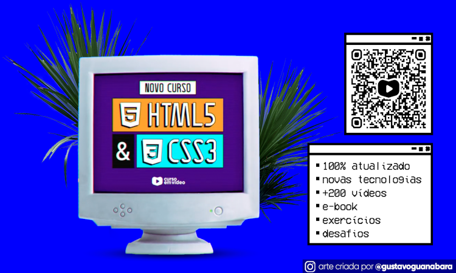
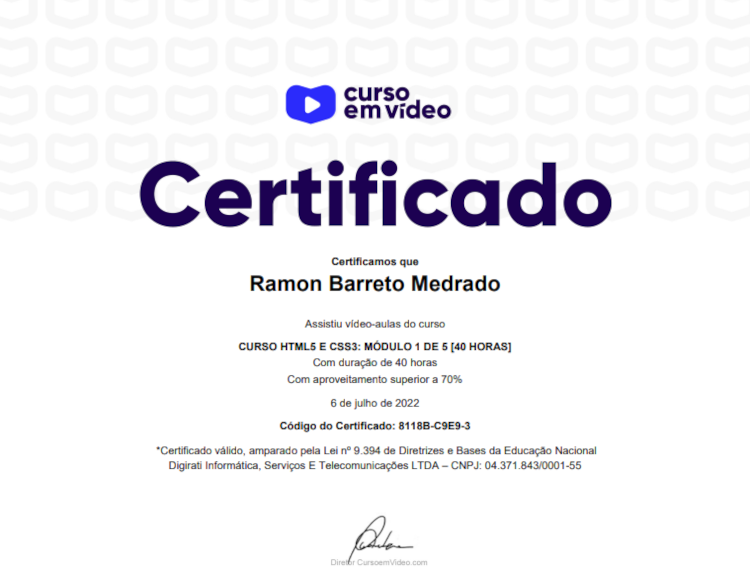

  

  

## Curso de HTML5 e CSS3 📘
### Curso em Vídeo ▶

  

- [x] Estudo sobre a Linguagem de Marcação HTML5 e Linguagem de Estilização CSS3
- [x] Realização de exercícios e desafios para fixar conhecimento, junto com o professor <a target="_blank" href="https://www.linkedin.com/in/guanabara/">Gustavo Guanabara</a>.
- [x] Aprendizados necessários sobre o funcionamento da internet; conhecimentos sobre back-end, front-end e full stack; inserção de conteúdos semânticamente; estilização inline, estilização externa; harmonia de cores e suas psicologias, criação de documentos com degradê de cores; Tipografia, utilização de fontes externas; aprendizados sobre a técnica shorthand, Pseudo-classes em CSS3 e Pseudo-elementos; Modelagem de caixas; Grouping tags em HTML5; Variáveis em CSS3; Projetos responsivos; Configuração de Header e Footer; Vídeos responsivos entre outros aprendizados.

## Meu Certificado - Módulo 01 📃🎉

  

## Meu Certificado - Módulo 02 📃🎉

  

## Tecnologias 🛠

- HTML5
- CSS3

## Instrutor 👨🏽‍🏫
- <a target="_blank" href="https://www.linkedin.com/in/guanabara/">Gustavo Guanabara</a>

## Aluno 👨🏽‍🎓

- <a target="_blank" href="https://www.linkedin.com/in/ramon-barreto-076191180/">Ramon Barreto</a>

## Contato 📲

- Email: ramon_barreto_medrado@hotmail.com

